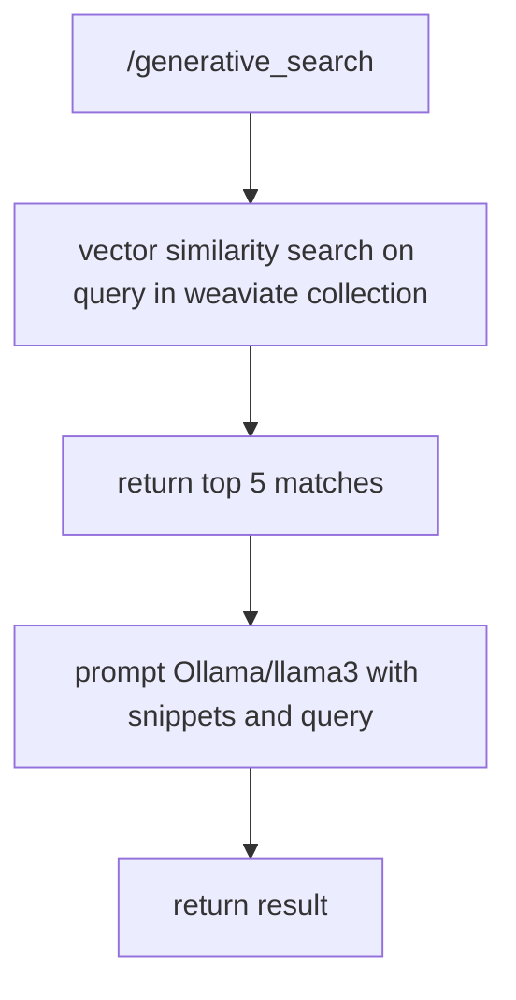

```mermaid
graph TD
  A["/generative_search"] --> B["vector similarity search on query in weaviate collection"]
  B --> C["return top 5 matches"]
  C --> D["prompt Ollama/llama3 with snippets and query"]
  D --> E["return result"]
```
